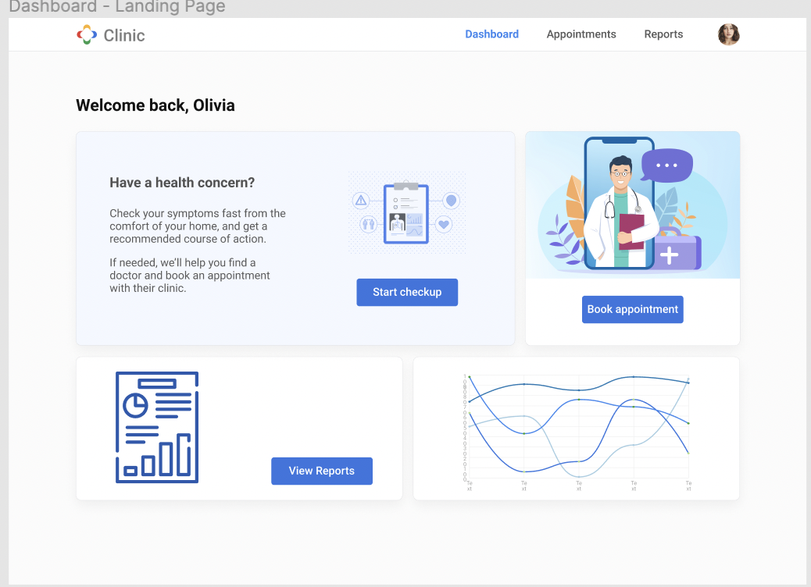
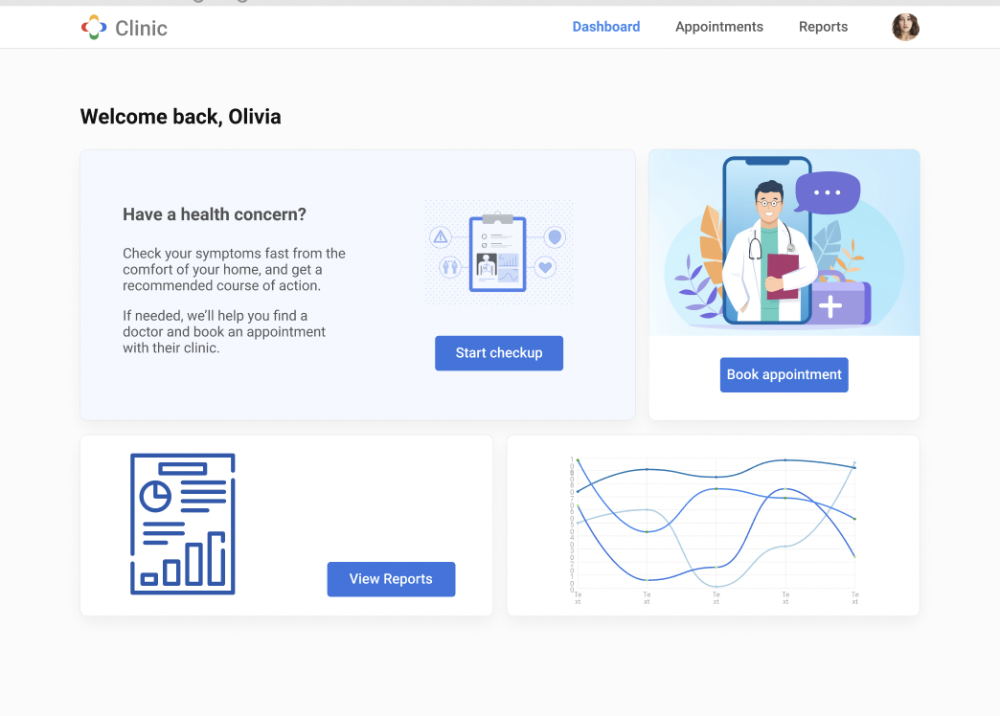

# google-hackathon: Clinic patient scheduler and checkup tool

Google Hackathon: Web Developers: Kathleen Gladstone, Molly Beach, Farzana Shampa. UX designers: Lisa Villary, Divya Nagpal, Sam Chaaya. Data Science: David Arnold,  Nataliya Parshyna. Digital Marketing: Yonge Au. Project Manager: Kea Leagard.

Clinic is a HIPAA-compliant cloud-based patient interaction tool that works with any electronic health record system. Clinic offers secure two-way messaging, electronic patient forms, smart appointment scheduling and reminders, mass texting, automated survey and rating requests, online payments, and multi-user telemedicine to deliver a full patient engagement experience. We are able to incorporate seamlessly with virtually every electronic health record system.

